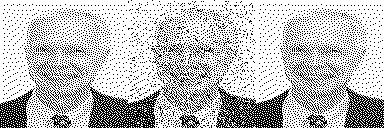

# Hopfield
Repository for experiments with Hopfield and related networks.

> A Hopfield network is a form of recurrent artificial neural network popularized by John Hopfield in 1982, but described earlier by Little in 1974 -- [Wikipedia](https://en.wikipedia.org/wiki/Hopfield_network)

Ι'm studying these networks for their simplicity and potential to represent a memory in another [project](https://github.com/Ariel-Perez/brain).

The script takes images from a given directory and trains a network to remember them. Then it adds noise to the images and attempts to retrieve them using the Hopfield network. It can be run from the command line.

```bash
main.py [-h] [--directory DIRECTORY] [--noise NOISE] [--output OUTPUT]
```

The arguments are all optional:
  --directory -- Directory to obtain the sample images from -- default: samples
  --noise -- Fraction of bits randomized for evaluation -- default: 0.1
  --output -- Output directory -- default: output


An example output is shown on the image above, with three images displayed side-by-side.
The left image shows John Hopfield, the middle one has added noise, and the right is the retrieved image.
